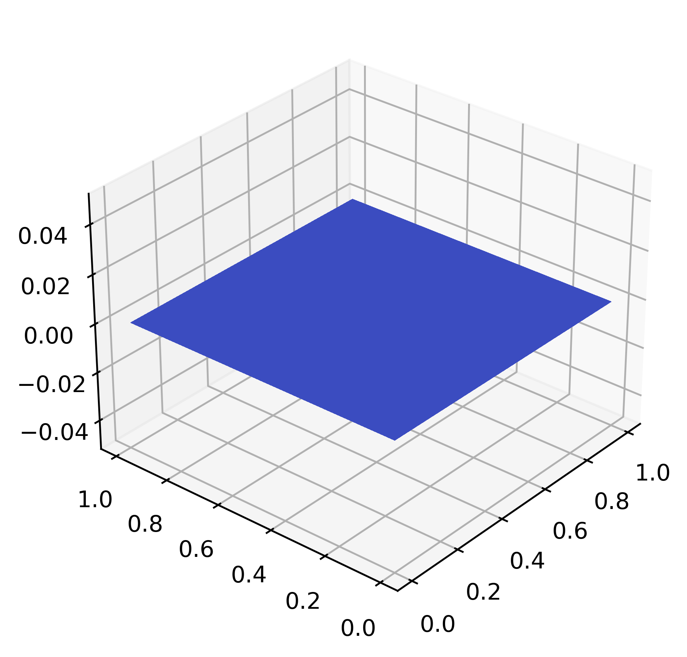
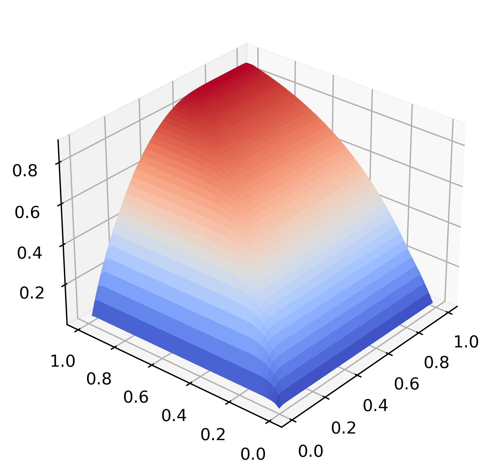

2D single-species advection-reaction-diffusion
==============================================

This problem focuses on the following 2D PDE:

.. math::

   \frac{\partial \phi}{\partial t} + u \frac{\partial \phi}{\partial x} + v \frac{\partial \phi}{\partial y} = D \left(\frac{\partial^2 \phi}{\partial x^2} + \frac{\partial^2 \phi}{\partial y^2} \right) - \sigma \phi + f(x, y, t)

* Initial conditions: :math:`\phi(x, y, 0) = 0`

* Default settings:

  - :math:`u = 0.5 \cos(\pi/3), v = 0.5 \sin(\pi/3)`

  - :math:`D = 0.001`, :math:`\sigma = 1`

  - :math:`f(x, y, t) = 1`

* Domain is unit square :math:`[0,1]^2` with homogeneous Dirichlet BC

* :math:`u, v, D, \sigma` can be customized via the problem constructor (more below)

Mesh
----

.. code-block:: shell

   python3 pressio-demoapps/meshing_scripts/create_full_mesh_for.py \
           --problem advdiffreac2d_s<stencilSize> -n Nx Ny --outDir <destination-path>

where

- ``Nx, Ny`` is the number of cells you want along :math:`x` and :math:`y` respectively

- ``<stencilSize> = 3 or 5 or 7``: defines the neighboring connectivity of each cell

- ``<destination-path>`` is where you want the mesh files to be generated

C++ synopsis
------------

.. code-block:: c++

   #include "pressiodemoapps/advection_diffusion_reaction2d.hpp"

   int main(){
     namespace pda = pressiodemoapps;

     const auto meshObj = pda::load_cellcentered_uniform_mesh_eigen("path-to-mesh");

     const auto inviscidScheme = pda::InviscidFluxReconstruction::FirstOder; //or Weno3, Weno5

     // A. constructor for problem using default values
     {
       const auto probId  = pda::AdvectionDiffusionReaction2d::ProblemA;
       auto problem = pda::create_problem_eigen(meshObj, probId, inviscidScheme);
     }

     // B. setting custom coefficients
     {
       using scalar_type = typename decltype(meshObj)::scalar_t;
       const scalar_type ux = 0.2;
       const scalar_type uy = 0.8;
       const scalar_type diff  = 0.01;
       const scalar_type sigma = 1.5;
       auto problem = pda::create_advdiffreac_2d_problem_A_eigen(meshObj, inviscidScheme,
                                                                 ux, uy, diff, sigma);
     }
   }

Python synopsis
---------------

.. code-block:: py

   import pressiodemoapps as pda

   meshObj = pda.load_cellcentered_uniform_mesh("path-to-mesh")

   scheme  = pda.InviscidFluxReconstruction.FirstOrder # or Weno3, Weno5

   # A. constructor for problem using default values
   probId  = pda.AdvectionDiffusionReaction2d.ProblemA
   problem = pda.create_problem(meshObj, probId, scheme)

   # B. setting custom coefficients
   ux, uy, myD, sigma = 0.1, 0.5, 0.001, 1.5
   problem = pda.create_adv_diff_reac_2d_problem_A(meshObj, scheme, ux, uy, myD, sigma)

Notes:
------

.. important::

   Currently, for this problem the viscous schemes is fixed
   such that it yields a second-order viscuous scheme.

Sample Solution
---------------

Representative plot at :math:`t=0` (left) and :math:`t=3`,
using a ``50x50`` mesh with Weno5 and RK4 time integration with :math:`dt = 0.01`,
and default values for the physical coefficients:

