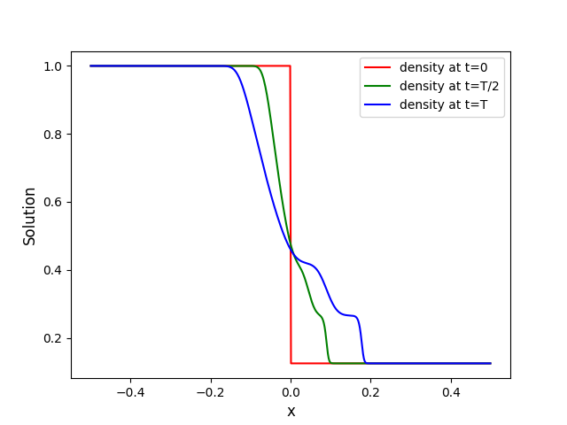

Step-by-step in C++
===================

This page shows you how to setup, build, run and visualize your first problem in C++.

For demonstration purposes, we show how to run the **1D Sod** problem,
but the *same* process applies to *every* other problem.

.. Hint::
   You can copy each snippet below by moving your mouse over
   the snippet's box, and clicking the copy icon
   appearing on the top-right corner.

Step 1: Prepare
---------------

The C++ library is header-only so it does not need to be compiled and installed.

.. code-block:: shell

    export CXX=<path-to-your-CXX-compiler> # must support C++17
    export MYTEST=/home/myDemoTest
    mkdir $MYTEST && cd $MYTEST
    git clone --recursive git@github.com:Pressio/pressio-demoapps.git
    cd pressio-demoapps

.. _step-2:

Step 2: Generate the mesh
-------------------------

.. code-block:: shell

   python3 $MYTEST/pressio-demoapps/meshing_scripts/create_full_mesh_for.py \
           --problem sod1d_s7 --outdir ${MYTEST}/mesh -n 500

where ``sod1d_s7`` specifies that we want Sod1d and
a 7-point stencil, and ``500`` is the number of cells.
The mesh files are generated inside ``${MYTEST}/mesh``.

Step 3: Create Main File
------------------------

Create a ``main.cpp`` as follows:

.. code-block:: shell

    touch $MYTEST/main.cpp

and open it in a text editor.

The next sections explain the program line-by-line. To jump to the complete, uncommented code,
see :ref:`complete-file-label`.

Includes
^^^^^^^^

First, we need to include Pressio's explicit steppers. These are abstractions that
represent "how" to take a step when applying an explicit scheme to initial value problems.

You can read more about them in the `Pressio-ROM documentation <https://pressio.github.io/pressio-rom/components/ode_steppers_explicit.html>`_.

.. code-block:: cpp

    #include "pressio/ode_steppers_explicit.hpp"

Next, we need functions to advance our stepper object forward in time.

.. code-block:: cpp

    #include "pressio/ode_advancers.hpp"

Finally, we include the default 1D Euler problem that we will solve (more information on
the problem can be found `here <https://pressio.github.io/pressio-demoapps/euler_1d_sod.html>`_).

.. code-block:: cpp

    #include "pressiodemoapps/euler1d.hpp"

Observer class to monitor and sample the simulation's state
^^^^^^^^^^^^^^^^^^^^^^^^^^^^^^^^^^^^^^^^^^^^^^^^^^^^^^^^^^^

In order to write out the state with a specified frequency,
we need to create an instance of the observer class.
This can be implemented with the following code:

.. code-block:: cpp

    template <typename StateType>
    class Observer
    {
        public:
        Observer(const std::string & f0, int freq)
            : myfile0_(f0,  std::ios::out | std::ios::binary),
            sampleFreq_(freq){}

        ~Observer(){
            myfile0_.close();
        }

        template<typename TimeType>
        void operator()(const pressio::ode::StepCount stepIn,
                const TimeType /*currentTime, unused*/,
                const StateType & state)
        {
            const auto step = stepIn.get();
            if (step % sampleFreq_ == 0){
		const std::size_t ext = state.size()*sizeof(double);
		myfile0_.write(reinterpret_cast<const char*>(&state(0)), ext);
            }
        }

        private:
	    std::ofstream myfile0_;
	    int sampleFreq_ = {};
    };

main()
^^^^^^

Create your main function:

.. code-block:: cpp

    int main() {}

.. Note:: All of the subsequent code will go inside of the ``main()`` function.

First, we'll create an alias to simplify our program.

.. code-block:: cpp

    namespace pda = pressiodemoapps;

Then we load the mesh that we created in :ref:`step-2`.

.. code-block:: cpp

    const auto meshObj = pda::load_cellcentered_uniform_mesh_eigen(".");

.. Note:: ``"."`` (above) assumes that ``mesh/`` is located in the same directory as ``main.cpp`` (this should be your ``$MYTEST`` directory).

For this demonstration, we will use First-Order Inviscid Flux Reconstruction.

.. code-block:: cpp

    constexpr auto order = pda::InviscidFluxReconstruction::FirstOrder;

Now we create the simulation problem for Euler 1D equations and initialize the state.

.. code-block:: cpp

    auto appObj = pda::create_problem_eigen(meshObj, pda::Euler1d::Sod, order);
    using app_t = decltype(appObj);
    using state_t = typename app_t::state_type;
    state_t state = appObj.initialCondition();

We use built-in time stepping with Runge-Kutta4 and instantiate our Observer class
such that the state is observed and saved to file every step.

.. code-block:: cpp

    auto stepperObj = pressio::ode::create_rk4_stepper(appObj);
    const int observeEveryNSteps = 1;
    Observer<state_t> Obs("sod1d_solution.bin", observeEveryNSteps);

Then we set our simulation parameters, where ``dt`` is the time step size and
the total number of steps is given by ``Nsteps``.

.. code-block:: cpp

    const auto dt = 0.001;
    const auto Nsteps = pressio::ode::StepCount(100);

Then we advance the simulation forward ``Nsteps``.

.. code-block:: cpp

    pressio::ode::advance_n_steps(stepperObj, state, 0., dt, Nsteps, Obs);

Finally, we return ``0`` if the process succeeds.

.. code-block:: cpp

    return 0;

.. _complete-file-label:

Complete File
^^^^^^^^^^^^^

The full, uncommented file is:

.. code-block:: cpp

    #include "pressio/ode_steppers_explicit.hpp"
    #include "pressio/ode_advancers.hpp"
    #include "pressiodemoapps/euler1d.hpp"

    template <typename StateType>
    class Observer
    {
        public:
        Observer(const std::string & f0, int freq)
            : myfile0_(f0,  std::ios::out | std::ios::binary),
            sampleFreq_(freq){}

        ~Observer(){
            myfile0_.close();
        }

        template<typename TimeType>
        void operator()(const pressio::ode::StepCount stepIn,
                const TimeType /*currentTime, unused*/,
                const StateType & state)
        {
            const auto step = stepIn.get();
            if (step % sampleFreq_ == 0){
            const std::size_t ext = state.size()*sizeof(double);
            myfile0_.write(reinterpret_cast<const char*>(&state(0)), ext);
            }
        }

        private:
        std::ofstream myfile0_;
        int sampleFreq_ = {};
    };

    int main()
    {
        namespace pda = pressiodemoapps;
        const auto meshObj = pda::load_cellcentered_uniform_mesh_eigen(".");

        constexpr auto order = pda::InviscidFluxReconstruction::FirstOrder;

        auto appObj = pda::create_problem_eigen(meshObj, pda::Euler1d::Sod, order);
        using app_t = decltype(appObj);
        using state_t = typename app_t::state_type;
        state_t state = appObj.initialCondition();

        auto stepperObj = pressio::ode::create_rk4_stepper(appObj);
	const int observeEveryNSteps = 1;
	Observer<state_t> Obs("sod1d_solution.bin", observeEveryNSteps);

        const auto dt = 0.001;
        const auto Nsteps = pressio::ode::StepCount(100);
        pressio::ode::advance_n_steps(stepperObj, state, 0., dt, Nsteps, Obs);

        return 0;
    }

Step 4: Compile and Run
-----------------------

You can compile ``main.cpp`` either on the command line or using ``cmake``.

Command line
^^^^^^^^^^^^

.. code-block:: shell

    $CXX \
    -I $MYTEST/pressio-demoapps/include \
    -I $MYTEST/pressio-demoapps/tpls/eigen3 \
    -I $MYTEST/pressio-demoapps/tests_cpp/pressio/include \
    main.cpp -o main

..
   CMake
   ^^^^^

   Create a ``CMakeLists.txt`` file at the same level as ``main.cpp``:

   .. code-block:: shell

       touch CMakeLists.txt

   Then copy/paste the following into your ``CMakeLists.txt`` file.

   .. code-block:: cmake

       cmake_minimum_required(VERSION 3.10)
       project(PressioCppDemo)

       set(CMAKE_CXX_STANDARD 17)
       set(CMAKE_CXX_STANDARD_REQUIRED ON)

       include_directories("${MYTEST}/pressio-demoapps/include")
       include_directories("${MYTEST}/pressio-demoapps/tpls/eigen3")
       include_directories("${MYTEST}/pressio-demoapps/tests_cpp/pressio/include")

       add_executable(main main.cpp)

..
   From your ``${MYTEST}`` directory, run:

   .. code-block:: shell

       cmake .
       make

Running
^^^^^^^

Once you have compiled your code, you will have a new ``main`` executable in ``$MYTEST``.
To execute it, simply run:

.. code-block:: shell

    ./main

Step 5: Visualize Results
-------------------------

Running ``main`` will produce a binary file ``sod1d_solution.bin`` that holds the state
at every timestep.

To visualize the results, you can use the following steps.

1. Create a Python file, ``plot.py``, in the ``$MYTEST`` directory
   and fill its content with:

.. code-block:: python

    #!/usr/bin/env python3

    import matplotlib.pyplot as plt
    from matplotlib import cm
    import numpy as np
    from numpy import linalg as LA
    import re

    def extractN(ns):
	reg = re.compile(r''+ns+'.+')
	file1 = open('mesh/info.dat', 'r')
	strings = re.search(reg, file1.read())
	file1.close()
	assert(strings)
	return int(strings.group().split()[1])

    ##########################
    if __name__== "__main__":
    ##########################
        nx = extractN('nx')
        print(nx)
        fomTotDofs = nx*3

        x = np.loadtxt('mesh/coordinates.dat', dtype=float)[:,1]

        data = np.fromfile("sod1d_solution.bin")
        nt = int(np.size(data)/fomTotDofs)
        print("fomTest: nt = ", nt)
        data = np.reshape(data, (nt, fomTotDofs))

        fig = plt.figure(1)
        density_t0 = np.reshape(data[0,:], (nx, 3))[:,0]
        density_thalf = np.reshape(data[int(nt/2),:], (nx, 3))[:,0]
        density_tfinal = np.reshape(data[nt-1,:], (nx, 3))[:,0]
        plt.plot(x, density_t0, '-r', label='density at t=0')
        plt.plot(x, density_thalf, '-g', label='density at t=T/2')
        plt.plot(x, density_tfinal, '-b', label='density at t=T')

        plt.xlabel("x", fontsize=12)
        plt.ylabel("Solution", fontsize=12)
        plt.legend()
        fig.savefig("solution.png", format="png", bbox_inches='tight', dpi=450)
        plt.show()

.. note:: You may have to specify the paths to ``info.data`` and ``coordinates.dat`` (which are in the the ``mesh`` directory that you generated in :ref:`step-2`).

3. Run the script from your ``$MYTEST`` directory.

.. note:: You may need to install some packages, like ``numpy`` or ``matplotlib``, into your Python environment.

.. code-block:: shell

    python visualize_state.py

This should display the following figure:

