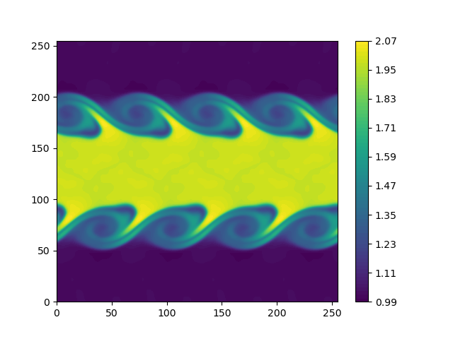

2D Euler Kelvin-Helmholtz
=========================

This problem solves the *2D conservative Euler equations*.

- Domain is :math:`\Omega = \Omega_1 \cup \Omega_2 = [-5,5]^2` with periodic BC where:

  - :math:`\Omega_1 = [-5,5] \times [-2 + \cos( 0.8 \pi x) , 2 + \cos(0.8 \pi x)]`

  - :math:`\Omega_2`: Rest of the domain

* Initial conditions in primitive variables: 

  - in :math:`\Omega_1`: :math:`\rho = 2, u = 0.5, v = 0, p = 2.5`

  - in :math:`\Omega_2`: :math:`\rho = 1, u = -0.5, v = 0, p = 2.5`

  - This IC is used to create the corresponding initial conditions in conservative variables.

- Time integration performed for 2.5 flow through units, :math:`t \in (0, 50)`

- Mach number in :math:`\Omega_1` : :math:`M_{\infty} = 0.377964`

- Mach number in :math:`\Omega_2` : :math:`M_{\infty} = 0.267261`

- This problem is often *unstable* for a standard Galerkin ROM

Mesh
----

.. code-block:: shell

   python3 pressio-demoapps/meshing_scripts/create_full_mesh_for.py \
           --problem euler2dKelvinHelmholtz_s{3,5,7} -n Nx Ny --outDir <destination-path>

where ``Nx, Ny`` are the number of cells you want along :math:`x` and :math:`y` respectively, and ``<stencilSize> = 3 or 5 or 7``,
and ``<destination-path>`` is where you want the mesh files to be generated.

C++ synopsis
------------

.. code-block:: c++

   #include "pressiodemoapps/euler2d.hpp"
   // ...
   namespace pda     = pressiodemoapps;
   const auto probId = pda::Euler2d::KelvinHelmholtz;
   const auto scheme = pda::InviscidFluxReconstruction::FirstOder; //or Weno3, Weno5
   auto problem      = pda::create_problem_eigen(meshObj, probId, scheme);
   auto state	     = problem.initialCondition();

Python synopsis
---------------

.. code-block:: py

   import pressiodemoapps as pda
   # ...
   probId  = pda.Euler2d.KelvinHelmholtz
   scheme  = pda.InviscidFluxReconstruction.FirstOrder # or Weno3, Weno5
   problem = pda.create_problem(meshObj, probId, scheme)
   state   = problem.initialCondition()

Sample Plot
-----------

Representative *density* field at selected time :math:`t=50` using a ``256x256`` mesh with Weno5
and RK4 time integration:

