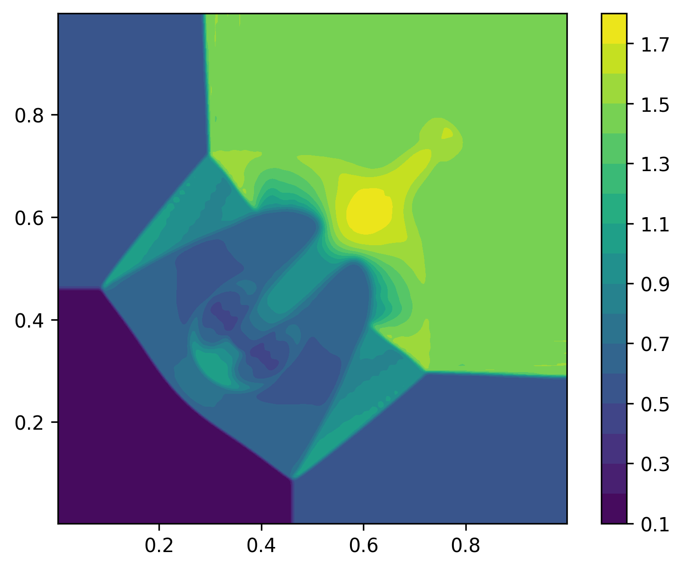

2D Euler Riemann
================

- Domain is [0.0, 1.0]^2 with homogeneous Neumann on all boundaries

- various initial conditions are supported:

- IC when `icId==1` is taken from page 15 of `paper1 <https://www.researchgate.net/publication/269636534_A_Compact_Third-Order_Gas-Kinetic_Scheme_for_Compressible_Euler_and_Navier-Stokes_Equations>`_:

  - :math:`x>=0.5, y>=0.5`: :math:`\rho = 0.5313, u = 0, v = 0, p = 0.4`

  - :math:`x<0.5, y>=0.5`: :math:`\rho = 1, u = 0.7276., v = 0, p = 1`

  - :math:`x<0.5, y<0.5`: :math:`\rho = 0.8, u = 0, v = 0., p = 1`

  - :math:`x>0.5, y<0.5`: :math:`\rho = 1., u = 0, v = 0.7276, p = 1`

  - Time integration is performed for :math:`t \in (0, 0.2)`.

- IC when `icId==2` which is configuration 3 of `paper2 <http://www.amsc-ouc.ac.cn/Files/Papers/2016_Don_Hybrid%20Compact-WENO%20finite%20difference%20scheme%20with%20conjugate%20Fourier%20shock%20detection%20algorithm%20for%20hyperbolic%20conservation%20laws.pdf>`_

  - :math:`x>=0.8, y>=0.8`: :math:`\rho = 1.5, u = 0, v = 0, p = 1.5`

  - :math:`x<0.8, y>=0.8`: :math:`\rho = 0.5323, u = 1.206, v = 0, p = 0.3`

  - :math:`x<0.8, y<0.8`: :math:`\rho = 0.138, u = 1.206, v = 1.206, p = 0.029`

  - :math:`x>0.8, y<0.8`: :math:`\rho = 0.5323, u = 0, v = 1.206, p = 0.3`

  - Time integration is performed for :math:`t \in (0, 0.8)`.

Mesh
----

.. code-block:: shell

   cd pressio-demoapps/meshing_scripts
   python create_full_mesh_for.py --problem riemann2d_s{3,5,7} -n Nx Ny --outDir <destination-path>

where ``Nx, Ny`` are the number of cells, and ``<stencilSize> = 3 or 5 or 7``, 
and ``<destination-path>`` is where you want the mesh files to be generated.

C++ synopsis
------------

.. code-block:: c++

   namespace pda = pressiodemoapps;
   const auto probId = pda::Euler2d::Riemann;
   const auto scheme = pda::InviscidFluxReconstruction::FirstOder; //or Weno3, Weno5
   auto problem      = pda::create_problem_eigen(meshObj, probId, scheme [, icId]);
   auto state	     = problem.initialCondition();

Where the ``icId`` is an integer identifying the initial condition above.

Python synopsis
---------------

.. code-block:: py

   import pressiodemoapps as pda
   probId  = pda.Euler2d.Riemann
   scheme  = pda.InviscidFluxReconstruction.FirstOrder # or Weno3, Weno5
   problem = pda.create_problem(meshObj, probId, scheme [, icId])
   state   = problem.initialCondition()

Where the ``icId`` is an integer identifying the initial condition above.

Sample Plot
-----------

Representative *density* plot at `t=0.8` starting from icId=2 with Weno5, SSPRK3 time integration:

