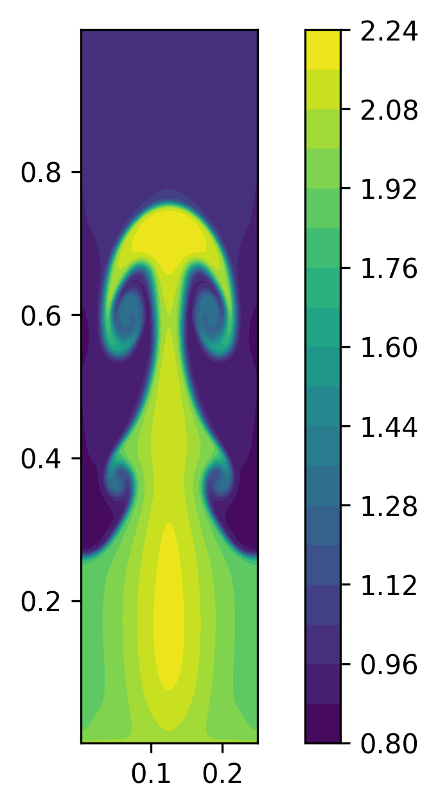

2D Euler Rayleigh-Taylor
========================

This problem simulates the Rayleigh-Taylor using the *2D conservative Euler equations*.

- Domain is rectangular: :math:`[0.0, 0.25] \times [0.0, 1.0]`

- BCs:

  - reflective at left wall (:math:`x=0`) and right wall (:math:`x=0.25`)

  - Dirichlet at the bottom (:math:`y=0`) such that: :math:`(\rho, u, v, p) = (2, 0, 0, 1)`

  - Dirichlet at the top (:math:`y=1`) such that: :math:`(\rho, u, v, p) = (1, 0, 0, 2.5)`

- Initial condition:

  - For :math:`0 \leq y \lt 0.5`:

    :math:`(\rho, u, v, p) = (2.0, 0.0, -\delta \sqrt{\gamma \frac{p}{\rho}} \cos(8 \pi x), 2y+1)`

  - For :math:`0.5 \leq y \leq 1.0`:

    :math:`(\rho, u, v, p) = (1.0, 0.0, -\delta \sqrt{\gamma \frac{p}{\rho}} \cos(8 \pi x), y+1.5)`

- Default settings:

  - :math:`\delta = 0.025`

  - The heat capacity is set to: :math:`\gamma = 5/3`

* See the following references: `link1 <https://www.researchgate.net/publication/335403677_An_Efficient_Adaptive_Central-Upwind_WENO-CU6_Numerical_Scheme_with_a_New_Sensor>`_.

.. Important::

   The gravity effect is implemented by adding :math:`\rho` and :math:`\rho v`
   to the right-hand side of the y-momentum equation and energy equation, respectively.

Mesh
----

.. code-block:: shell

   python3 pressio-demoapps/meshing_scripts/create_full_mesh_for.py \
           --problem rti2d_s{3,5,7} -n Nx Ny --outDir <destination-path>

where ``Nx, Ny`` are the number of cells, and ``<stencilSize> = 3 or 5 or 7``,
and ``<destination-path>`` is where you want the mesh files to be generated.

C++ synopsis
------------

.. code-block:: c++

   #include "pressiodemoapps/euler2d.hpp"
   // ...
   namespace pda     = pressiodemoapps;
   const auto probId = pda::Euler2d::RayleighTaylor;
   const auto scheme = pda::InviscidFluxReconstruction::FirstOder; //or Weno3, Weno5

   // 1. use default amplitude
   auto problem  = pda::create_problem_eigen(meshObj, probId, scheme);

   // 2. specify initial amplitude
   auto problem  = pda::create_problem_eigen(meshObj, probId, scheme, delta);

Python synopsis
---------------

.. code-block:: py

   import pressiodemoapps as pda
   # ...
   probId  = pda.Euler2d.RayleighTaylor
   scheme  = pda.InviscidFluxReconstruction.FirstOrder # or Weno3, Weno5

   // 1. use default amplitude
   problem = pda.create_problem(meshObj, probId, scheme)

   // 2. specify initial amplitude
   auto problem  = pda::create_problem_eigen(meshObj, probId, scheme, delta);

Sample Plot
-----------

Representative *density* plot at ``t=1.95`` using default settings,
with ``Weno5``, a mesh of `100x400` and SSPRK3 time integration:

