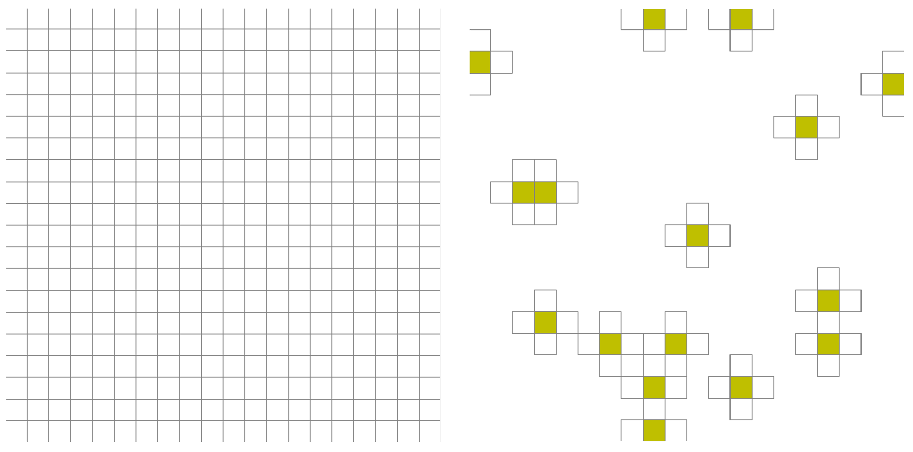

Sample Mesh Capabilty
=====================

One of the key features of pressio-demoapps is its native support for *sample mesh*.

What is a sample mesh and why?
------------------------------

.. Important::
   In practice, a sample mesh is a disjoint collection
   of cells where one computes the velocity (or RHS or residual) vector
   and Jacobian matrix of the target system.

The sample mesh is critical, for example, for projection-based ROMs of nonlinear systems.
It is at the core of hyper-reduction methods, since it allows one to
create ROMs with a computational cost which *does not*
scale with the size of the full model's state vector.
One can also see the sample mesh as important for studying
function approximation: given samples of the residual collected
at the sample mesh, one can use these to reconstruct the residual
on the full mesh.

Several methods exist to determine which cells to include, e.g., random sampling,
the `discrete empirical interpolation method (DEIM) <https://doi.org/10.1137/090766498>`_,
and `Gauss-Newton with approximate tensors (GNAT) <https://doi.org/10.1016/j.jcp.2013.02.028>`_.

While the sample mesh strictly speaking refers to the collection of cells
where we compute the residual and Jacobian, a related concept is what we refer to as **stencil mesh**.
We refer to **stencil mesh** the collection of cells that are needed to compute
the velocity or residual vector on the *sample mesh*.
Note that, in general, the sample mesh is a subset of the stencil mesh,
because to compute the velocity or residual at a given cell, one also needs
the cell-centered values at that target cell.

For more discussion on this, see `this page <https://pressio.github.io/proms/hyper/>`_.

Let's look at a figure to understand this
-----------------------------------------

The figure below shows a two dimensional full mesh (left) and
a sample and a stencil mesh for a first order cell-centered finite volume scheme.
The stencil mesh is the set of **all cells** shown, while the sample mesh
is the subset color-coded yellow.

The following is an example in three dimensions.

.. image:: ../../figures/readme_3dmesh.png
  :width: 75 %
  :alt: Alternative text

How to do all this in pressio-demoapps?
---------------------------------------

The ``pressio-demoapps/meshing/create_sample_mesh.py`` is the script we use for this.
Specifically, this script accepts a path to a full mesh and a list of cell indices,
and generate the new (reduced) mesh.

.. code-block:: bash

   python create_sample_mesh.py \
		--fullMeshDir        <path-to-the-FULL-mesh-dir-to-start-from> \
		--sampleMeshIndices  <path-to-ascii-file-with-desired-cell-indices-list> \
		--outDir <path-to-where-to-output-new-mesh> \
		--debug  true/false # default=false

where:

- ``--fullMeshDir``: full path to a FULL mesh directory; this dir should contain mesh files as generated using the ``create_full_mesh.py`` script of pressio-demoapps.

- ``--sampleMeshIndices``: full path to ASCII file with list of indices identifying the subset of cells you want to use a **sample** mesh cells. Note that this list must contain indices valid wrt the full mesh provided in ``fullMeshDir``.

- ``--workDir``: full path to directory such that:
  - this dir contains where you want all **new** mesh files to be generated;

Show me an example!
-------------------

Here we show an end-to-end example for 2D that includes: generating a full mesh,
visualizing it, selecting a subset of cells, generating a sample mesh
and visualizing the sample mesh.

To simplify things, let's set the following:

.. code-block:: bash

   export REPODIR=<full-path-to-your-clone-of-pressiodemoapps>
   export WORKDIR=/home/mesh_test

(A) Generate full mesh
^^^^^^^^^^^^^^^^^^^^^^

.. code-block:: bash

   python ${REPODIR}/meshing/create_full_mesh.py \
		-n 10 8 --outDir $WORKDIR/full_mesh \
		--bounds 0.0 1.2 0.0 1.0 \
		--periodic false -s 5

This creates the mesh files inside ``${WORKDIR}/full_mesh``
for a rectangular domain, using a 10x8 grid and setting a
target connectivity of 5 to specify how many neighbors each cell has.
If you look inside ``${WORKDIR}/full_mesh``, you will see these files:

- ``info.dat``: contains some info about the mesh

- ``connectivity.dat``: contains the connectivity graph for all cells

- ``coordinates.dat``: contains the x [in first column],
  y [in second column] coordinates for each *cell center*

If we then do:

.. code-block:: bash

   python ${REPODIR}/meshing/plot_mesh.py --wdir $WORKDIR/full_mesh -p show 9

where we use `show` to specify we want the figure plotted,
and 9 is the font size to use to print the global ID of each cell.
You should see this plot:

.. image:: ../../figures/docs_meshing_sample_1.png
  :width: 60 %
  :alt: Alternative text

(B) Select subset of cells, and generate sample mesh
^^^^^^^^^^^^^^^^^^^^^^^^^^^^^^^^^^^^^^^^^^^^^^^^^^^^

Let's say that we want our **sample mesh**
to comprise cells 1, 26, 36, 52, 67.
We can do:

.. code-block:: bash

   echo 1 26 36 52 67 >> ${WORKDIR}/sample_gids.txt
   python ${REPODIR}/meshing/create_sample_mesh.py \
		--outDir $WORKDIR/sample_mesh \
		--fullMeshDir $WORKDIR/full_mesh \
		--sampleMeshIndices $WORKDIR/sample_gids.txt

this will generate, inside ``$WORKDIR/sample_mesh``,
the mesh files for this "reduced" mesh.

Let's visualize this reduced mesh:

.. code-block:: bash

   python ${REPODIR}/meshing/plot_mesh.py --wdir $WORKDIR/sample_mesh -p show 9

You should see this plot:

.. image:: ../../figures/docs_meshing_sample_2.png
  :width: 60 %

In the figure above, the yellow cells are the "sample mesh cells",
which are those we wanted. All the remaining uniflled cells make
up the "stencil mesh". Note that the sample mesh script
automatically picks up the level of connecitivty used for
the starting full mesh. If you recall above, we used ``-s 5``
when generating the full mesh, meaning we wanted
a 5-pt stencil connectivity for each cell.

.. Attention::
   Note how the reduced mesh has a different enumeration of the cells.
   This is because this new mesh is effectively a new, self-contained mesh.

**todo: finish**
